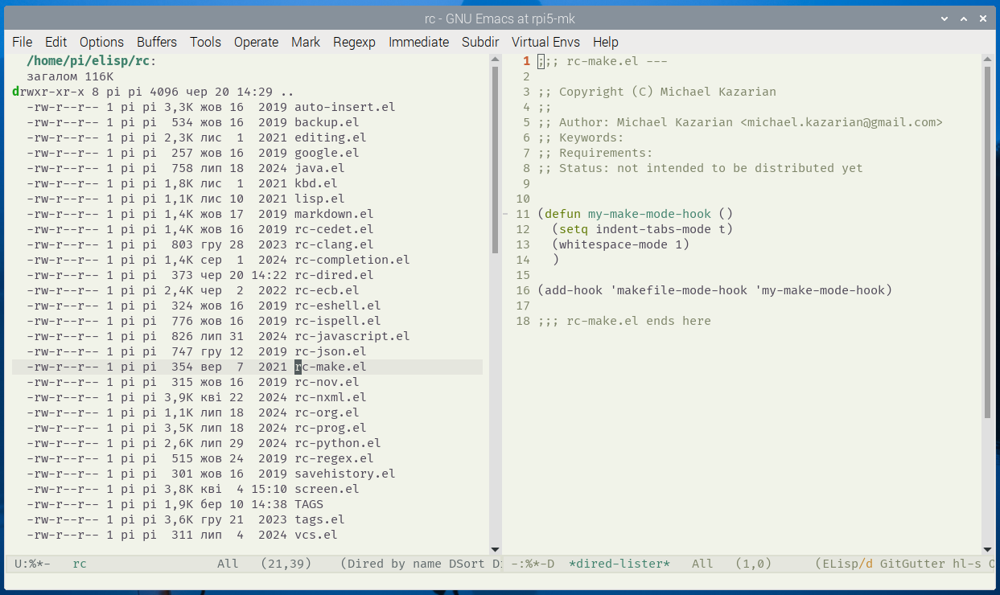

# dired-lister
Emacs Lisp package that provides a minor mode for Dired, enabling convenient file preview in a side window.

## Features
- Preview files in a side window (default: right side) using `TAB`.
- Close the preview with `q` or edit the file with `e`.
- Automatically closes the preview window when quitting Dired (`q` or `C-x k`).
- Customizable keybindings, window position, and preview behavior.
- Locally disables specified modes (e.g., `company-mode`) and hooks (e.g., `after-change-major-mode-hook`) in the preview buffer to avoid unwanted behavior.
- Optional verbose logging for debugging and initialization.



## Installation
1. Place `dired-lister.el` in your Emacs load path.
2. Add the following to your `.emacs` or `init.el`:
   ```elisp
   (require 'dired-lister)
   (dired-lister-mode 1) ; Enable globally
   ```

## Usage
1. Enable `dired-lister-mode` (see Installation).
2. Open a Dired buffer.
3. Press `TAB` (or your custom key, see `dired-lister-file-key`) to preview the file at point.
4. In the preview window:
   - Press `q` (or `dired-lister-quit-key`) to close the preview.
   - Press `e` (or `dired-lister-edit-key`) to edit the file.
5. Press `q` (or `dired-lister-quit-dired-key`) in Dired to quit Dired and close the preview.

## Customization
Customize settings via `M-x customize-group RET dired-lister RET` or by adding Lisp code to your `.emacs` or `init.el`. Available options include:

- `dired-lister-auto-focus`: Set to `t` to focus the preview window after opening (default: `nil`).
- `dired-lister-window-side`: Choose the preview window side (`right`, `left`, `top`, `bottom`; default: `right`).
- `dired-lister-file-key`, `dired-lister-quit-dired-key`, `dired-lister-quit-key`, `dired-lister-edit-key`: Customize keybindings.
- `dired-lister-disabled-modes`, `dired-lister-disabled-hooks`: Specify modes and hooks to disable locally in the preview buffer.
- `dired-lister-verbose`: Set to `t` to display operation messages in the echo area (default: `nil`)

Example Lisp customization:
```elisp
(setq dired-lister-auto-focus t)          ; Focus preview window on opening
(setq dired-lister-window-side 'left)     ; Show preview on the left side
(setq dired-lister-file-key (kbd "C-f"))  ; Change preview key to C-f
(setq dired-lister-disabled-modes         ; Disable additional modes in preview
      '(company-mode flyspell-mode))
(setq dired-lister-disabled-hooks         ; Disable additional hooks in preview
      '(after-change-major-mode-hook org-mode-hook))
(setq dired-lister-verbose t)             ; Show debug messages
```

## Requirements
- Emacs 26.1 or later.

## License
Dired Lister is distributed under the GNU General Public License v3.0 or later. See the [LICENSE](https://www.gnu.org/licenses/) for details.

## Status
This package is not yet intended for public distribution. For updates, check the [GitHub repository](https://github.com/michael-kazarian/rc-dired).

## Author
Michael Kazarian (<michael.kazarian@gmail.com>)
